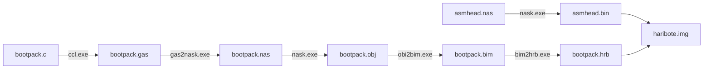
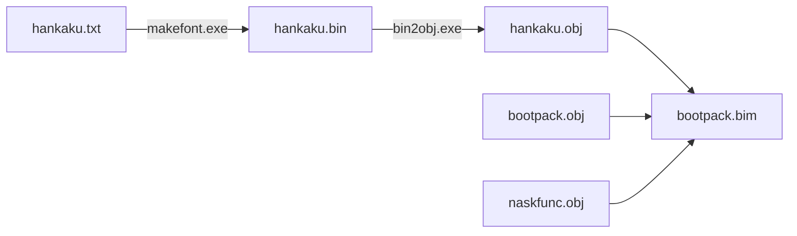

> 注：原书《三十天自制操作系统》比这份笔记生动易懂得多，这个笔记只是做一个总结。
{: .prompt-info }

# day1

完全手写了程序系统镜像文件`hellos.img`，作者使用[Bz软件](https://www.vcraft.jp/soft/bz.html)，本质上就是一个二进制编辑器，如果你用vs code编写项目，使用插件`Hex Editor`也可以。

镜像文件`hellos.img`本来是要拷到软盘上的（所以大小为1440kb），不过作者也提供了虚拟环境QEMU，不用担心没有软盘。

编写了文件`install.bat`，负责将镜像写入软盘，如果不使用软盘，这个批处理文件是不会用到的。

编写了文件`run.bat`，用于将镜像`helloos.img`拷贝到虚拟环境QEMU，然后启动操作系统。对于没有软盘的我们，主要使用这个批处理文件。

其中，使用到原书作者编写的批处理文件`!cons_nt.bat`，也许你发现了，只是简单把`cmd`调出来而已。

至此，可以实现启动一个最简陋的“操作系统”，只能显示`"hello world"`，其他什么也做不了。

使用汇编语言编写`helloos.nas`，使用原书作者提供的`nask.exe`编译器编译成`helloos.img`。

# day2

继续完善`helloos.nas`，补充并解释程序核心。本质上就是循环输出字符直到把`"hello world"`输出完，然后休眠。

优化流程，将`helloos.nas`主体制成`ipl.nas`，编译后就是我们的启动区，操作系统镜像剩余的部分会使用磁盘映像管理工具做。

修改批处理文件`asm.bat`，添加`makeimg.bat`。现在我们编译和调试的步骤是：

1. 使用`asm.bat`编译汇编语言代码`ipl.nas`生成`ipl.bin`。
2. 使用`makeimg.bat`将`ipl.bin`制作磁盘镜像文件`helloos.img`。
3. 使用`run.bat`拷贝镜像`helloos.img`到虚拟环境QEMU，启动操作系统。

之后，进一步优化流程，编写`Makefile`和`make.bat`将上面的三个命令进一步简化。

其中，`make.bat`只是将make命令引导至原书作者的工具箱，因为一般开发人员的电脑都会装有make程序，为了防止版本不兼容等错误，要引导至原书作者的工具箱。

现在，虽然核心仍是上面三步，有了`Makefile`的帮助下，只要使用命令`make run`就能一步做完所有工作并且启动操作系统。

此外，增添了两个功能命令：

- `make clean`：删除所有中间产物，只保留源代码以及`helloos.img`。
- `make src_only`：清理，只保留源代码。

# day3

制作真正的ipl，全称:InitialProgramLoader，中文意：首次装载系统，它就是我们的启动区，负责从磁盘读操作系统写入内存。

> 了解一个典型软盘的结构：80个柱面，2个磁头，18个扇区，一个扇区512字节。共 80 x 2 x 18 x 512Byte = 1440KB。
>
> 读盘顺序：C0-H0-S1（柱面0，磁头0，扇区1）, C0-H0-S2 ...... C0-H0-S18, C0-H1-S1 ...... C0-H1-S18, C1-H0-S1 ...... C1-H0-S18 ......C79-H1-S18。

当ipl启动时，它在内存中的启动区，即0x7c00，并且占用着缓冲区0x8000~0x8fff这512字节的内容，它的工作就是从磁盘读操作系统写到之后的缓冲区，即0x8200往后读10个柱面（暂定），每个柱面包含两个磁头（正反面），正面反面都有18个扇区。共 10 x 2 x 18 x 512Byte = 180KB。同时，读软盘可能出错，我们设置如果出错次数大于5则向用户报错。

改进了`Makefile`，引入了变量语法，让文件更加简洁，核心功能未变。

现在我们完成了启动区，是时候开始编写操作系统本体了。

使用汇编语言编写`haribote.nas`，之后编译成`haribote.sys`，即我们的操作系统主体，现在我们要将这个主体也保存进映像文件`haribote.img`（之前只有启动区），**如果我们有软盘**，操作流程为：

1.   使用`make install`命令将磁盘映像文件写入磁盘。
2.   在Windows中打开磁盘，把`haribote.sys`保存到磁盘上。
3.   使用工具将磁盘备份为磁盘映像。

其实和我们现在用U盘保存文件的过程差不多。但是我们没有软盘，可以用`edimg.exe`直接写映像文件。我们在向映像文件`haribote.img`保存文件时，我们会发现：

-   文件名会写在0x002600以后的地方。
-   文件`haribote.sys`内容会写在0x004200以后的地方。

之前启动区的任务是将磁盘内容写到内存0x8000之后的缓冲区，所以要正式启动我们的操作系统，启动区在最后应该跳到 0x8000 + 0x4200 = 0xc200 号地址，执行操作系统的第一行代码。

继续完善操作系统主体`haribote.nas`，我们打开VGA显卡模式，并且准备进入32位模式。

现在我们开始导入C语言，大改了`haribote.nas`，改名为`asmhead.nas`，增添的代码原书作者打算之后解释，我们写下了我们在这个操作系统中的第一行C语言，即文件`bootpack.c`。

从C语言文件`bootpack.c`到映像文件的处理过程如下：



至于为什么流程这么多，不像汇编，C语言文件编译后还有链接的过程，而且在这个玩具操作系统上工具链并不完善，所以会有许多中间产物。`Makefile`也做了相应的更改来处理C语言文件。

因为C语言不直接支持`HLT`汇编指令，编写了文件`naskfunc.nas`定义了对应的函数，现在C语言文件可以引用本来是汇编编写的函数，实现了在C语言环境中执行汇编。

总结一下今天的工作：真正的启动区，操作系统主体，C语言与汇编混编，一个全黑屏界面。

# day4

前一天界面还是全黑，现在我们让屏幕显示色彩。简单来说，就是向显存区域0xa0000~0xaffff写入字节。

设置了调色盘，复习一下，之前我们设置的VGA显卡模式色号只有8位，而一般的颜色表示是比如#ffffff一共24位表示，所以我们的操作系统只有有限的颜色（一共调色了16种颜色），需要使用调色板做颜色的映射。而使用调色板需要与显卡io端口做交互。

为了在C语言中使用汇编的`IN`和`OUT`指令与io做交互，而且因为使用`IN`和`OUT`前还要关中断，`naskfunc.nas`也定义了对应的函数。

现在有了颜色，我们要做的就是在界面上**画**出一个系统桌面，为了方便写了一个绘制长方形的函数，然后绘制各种长方形，看起来就像一个桌面。

# day5

为了规范与之后运行正确，优化`bootpack.c`，使用结构体（struct）从`asmhead.nas`接受启动信息并保存。具体从地址0x0ff0接收启动信息。

我们尝试开始显示字符，最简单的思路是定义一个数组，显示字符时按照数组的值一个一个画像素点。之后为了管理方便，在`hankaku.txt`定义了所以ASCII字符的点阵图，一共有256个字符，一个字符点阵占16字节大小，安装ASCII顺序排。将这个txt文本文件加入操作系统的流程为：



这是新加入的流程，其余流程见day3的流程图。当然，`Makefile`也要做调整。

在处理成`hankaku.obj`后，与编写下面的汇编语句功能是一样的：

```nasm
_hankaku:
	DB 各种数据（共4096字节）
```

之后我们可以在C语言程序中使用extern语法调用hankaku数组。

可以显示字符之后就简单了，编写了显示字符串的函数。之后，为了显示变量值以供调试，使用了`stdio.h`中的函数`sprintf`，这个函数与操作系统无关，只是将字符串写入内存。

现在我们为操作系统引入**分段**和**中断**的功能，具体来说初始化了**GDT**（**全局段号记录表**），**GDTR**寄存器，**IDT**（**中断记录表**）。并且设定了两个段，段1是0x00000000开始的4GB，是CPU可用的所有内存。段2是0x280000开始的512KB，为`bootpack.hrb`准备。其他的设置细节day6会讲。

>   **分段**（不是分页）：将4GB内存分成很多块，每一个块的起始地址都为0（相当于汇编语句的`ORG 0`）。为了表示一个段，需要：
>
>   1.   段的大小。
>   2.   段的起始地址。
>   3.   段的管理属性（禁止使用，禁止执行，系统专用等等）
>
>   段寄存器是16位，而低三位不能使用，所以段号可以使用0~8191的数，每个段消息都有8字节，一共8192x8B=64KB，这64KB的信息叫做**GDT**（**全局段号记录表**），整齐排列在内存中，其起始地址与有效设定个数放在CPU内部的**GDTR**特殊寄存器中。
>
>   **中断**：在外设完成工作或其他情况时引起中断通知CPU，就不需要CPU实时查询外设工作状态。中断号码可以使用0~255，这些中断号码与调用函数的对应信息被存在**IDT**中，也就是**中断记录表**。

