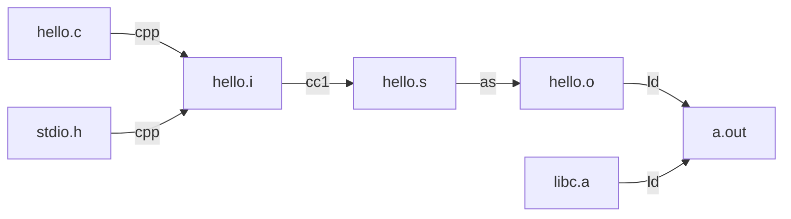

## 引入

尝试回答这些问题：

- 为什么程序从main函数开始执行？
- PE/ELF文件格式是什么？里面有什么？
- 如果我想写一个不需要操作系统的程序，怎么做？
- 目标文件是什么？
- 链接是什么？
- Hello World程序是怎么运行起来的？操作系统是怎么装载它的？
- main函数之前发生了什么？之后发生了什么？
- 程序在内存中是怎么布局的？
- printf函数是怎么实现的？

## GCC编译过程

以最简单的C语言hello world为例：

```c
#include<stdio.h>

int main(){
	printf("Hello World\n");
	return 0;
}
```

我们一般使用一步到位的编译方式：

```sh
gcc hello.c -o hello
```

其中隐藏的步骤包括：



1. 源文件(c)与头文件(h)经过**预编译**（cpp程序负责）生成预处理文件(i)，括号里面的是文件后缀。
1. 处理文件(i)经过**编译**（cc1程序负责）生成汇编代码文件(s)。
1. 汇编代码文件(s)经过**汇编**（as程序负责）生成目标文件(o)。
1. 目标文件(o)经过**链接**（ld程序负责）生成可执行文件(out)。

### 预编译

预编译命令是：

```sh
cpp hello.c hello.i
```

或者

```sh
gcc -E hello.c -o hello.i
```

`hello.i`文件很长，详见`code`文件夹，除了stdio头文件，剩下的是：

```
# 2 "hello.c" 2


# 3 "hello.c"
int main(){
 printf("Hello World\n");
 return 0;
}
```

预编译主要处理以`#`开头的语句，包括：

- 引入所有#include头文件，递归执行
- 处理#define，展开宏定义
- 处理条件预编译指令，比如#if，#ifdef等等
- 删除注释
- 添加行号和文件名标识，编译器需要
- 保留#pragma指令，编译器需要

### 编译

编译过程就是将预处理完的文件生成对应的汇编代码文件。

1. 扫描源代码，生成记号（token）
2. 语法分析，生成语法树
3. 语义分析，标识类型的语法树
4. 源代码优化，源码级优化，生成中间代码（目标机器无关）
5. 代码生成，生成目标机器代码
6. 目标代码优化

这涉及编译原理等一些内容， 它不是本书介绍的核心内容，参考大学课程编译原理。

> 关于地址，复习一下：
>
> - 程序源代码：地址以**符号**出现。
> - 编译成目标文件：符号绑定到**可重定位地址**（例如本模块开始的第14字节）。
> - 静态链接为可执行程序：将可重定位地址绑定到**绝对地址**，形成**逻辑地址**。
> - 装载（加载）：静态装入将程序运行所需要的指令和数据全部装入内存中。动态装入的思想是程序用到哪个模块，就将哪个模块装入内存，如果暂时不装入就存放在磁盘中。
> - 动态链接：在运行时进行链接。
> - 执行：进行动态重定位，指在程序运行过程中进行逻辑地址与**物理地址**的变换。
>
> 逻辑地址（虚拟地址）指CPU生成的地址，物理地址指内存单元看到的地址。

使用命令：

```sh
cc1 hello.i -o hello.s
```

或者

```sh
gcc -S hello.i -o hello.s
```

这一步中`gcc`调用`cc1`编译器来完成这个步骤，如果直接使用第一个命令，系统可能找不到`cc1`，自己找一下就行，可能在`/usr/lib/gcc/x86_64-linux-gnu/11`文件夹下。

`hello.s`的内容如下：

```nasm
	.file	"hello.c"
	.text
	.section	.rodata
.LC0:
	.string	"Hello World"
	.text
	.globl	main
	.type	main, @function
main:
.LFB0:
	.cfi_startproc
	endbr64
	pushq	%rbp
	.cfi_def_cfa_offset 16
	.cfi_offset 6, -16
	movq	%rsp, %rbp
	.cfi_def_cfa_register 6
	leaq	.LC0(%rip), %rax
	movq	%rax, %rdi
	call	puts@PLT
	movl	$0, %eax
	popq	%rbp
	.cfi_def_cfa 7, 8
	ret
	.cfi_endproc
.LFE0:
	.size	main, .-main
	.ident	"GCC: (Ubuntu 11.3.0-1ubuntu1~22.04.1) 11.3.0"
	.section	.note.GNU-stack,"",@progbits
	.section	.note.gnu.property,"a"
	.align 8
	.long	1f - 0f
	.long	4f - 1f
	.long	5
0:
	.string	"GNU"
1:
	.align 8
	.long	0xc0000002
	.long	3f - 2f
2:
	.long	0x3
3:
	.align 8
4:
```

### 汇编

汇编器是将汇编代码转变成机器可以执行的指令，每一个汇编语句几乎都对应一条机器指令。所以汇编器的汇编过程相对子编译器来讲比较简单，只是根据汇编指令和机器指令的对照表翻译就可以了。

上面的汇编过程我们可以调用汇编器 as 来完成：

```sh
as hello.s -o hello.o
```

或者：

```sh
gcc -c hello.c -o hello.o
```

汇编之后的二进制文件我们就看不懂了，可以展示二进制文件的命令有：

```sh
od hello.o
```

```
qmmms@qmmms-virtual-machine:~/shared$ od hello.o | head
0000000 042577 043114 000402 000001 000000 000000 000000 000000
0000020 000001 000076 000001 000000 000000 000000 000000 000000
0000040 000000 000000 000000 000000 001050 000000 000000 000000
0000060 000000 000000 000100 000000 000000 000100 000015 000014
0000100 044125 162611 106510 000005 000000 044000 143611 000350
0000120 000000 134000 000000 000000 141535 062510 066154 020157
0000140 067527 066162 000144 043400 041503 020072 052450 072542
0000160 072156 020165 030461 031456 030056 030455 061165 067165
0000200 072564 077061 031062 030056 027064 024461 030440 027061
0000220 027063 000060 000000 000000 000024 000000 000000 000000
```

使用反汇编：

```sh
 objdump -d hello.o > hello_o.txt
```

```
qmmms@qmmms-virtual-machine:~/shared$ cat hello_o.txt

hello.o：     文件格式 elf64-x86-64


Disassembly of section .text:

0000000000000000 <main>:
   0:	55                   	push   %rbp
   1:	48 89 e5             	mov    %rsp,%rbp
   4:	48 8d 05 00 00 00 00 	lea    0x0(%rip),%rax        # b <main+0xb>
   b:	48 89 c7             	mov    %rax,%rdi
   e:	e8 00 00 00 00       	call   13 <main+0x13>
  13:	b8 00 00 00 00       	mov    $0x0,%eax
  18:	5d                   	pop    %rbp
  19:	c3                   	ret    
```

### 链接

执行命令：

```sh
gcc hello.o -o hello
```

之后我们可以运行程序：

```
qmmms@qmmms-virtual-machine:~/shared$ ./hello
Hello World
```

链接是本书的主题，后文会详细讲解。